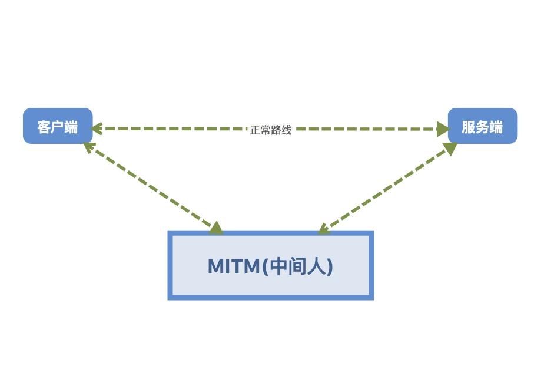
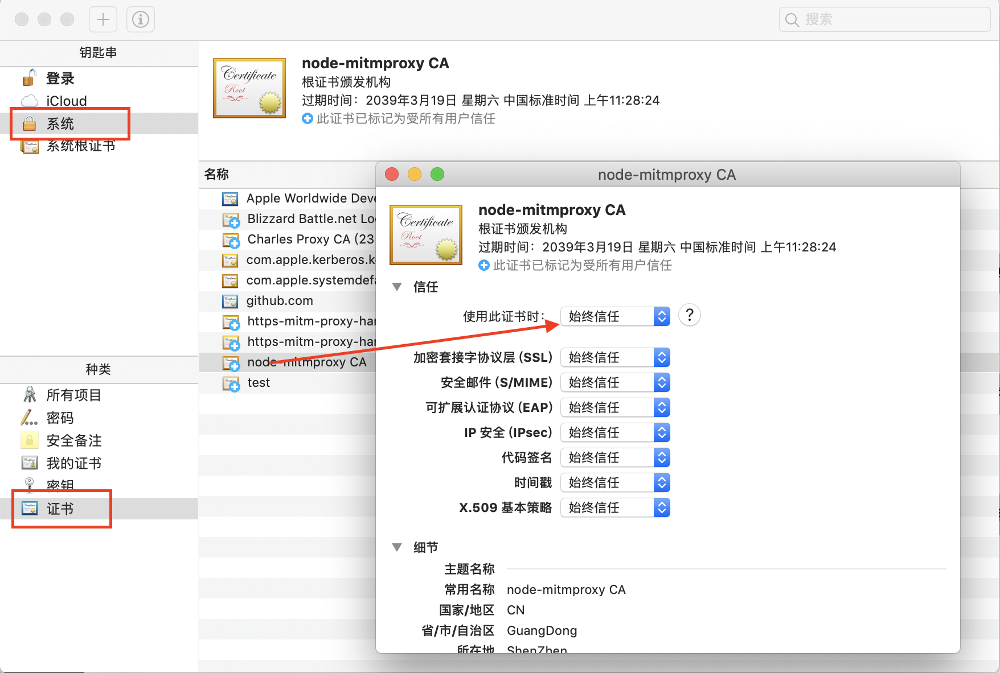
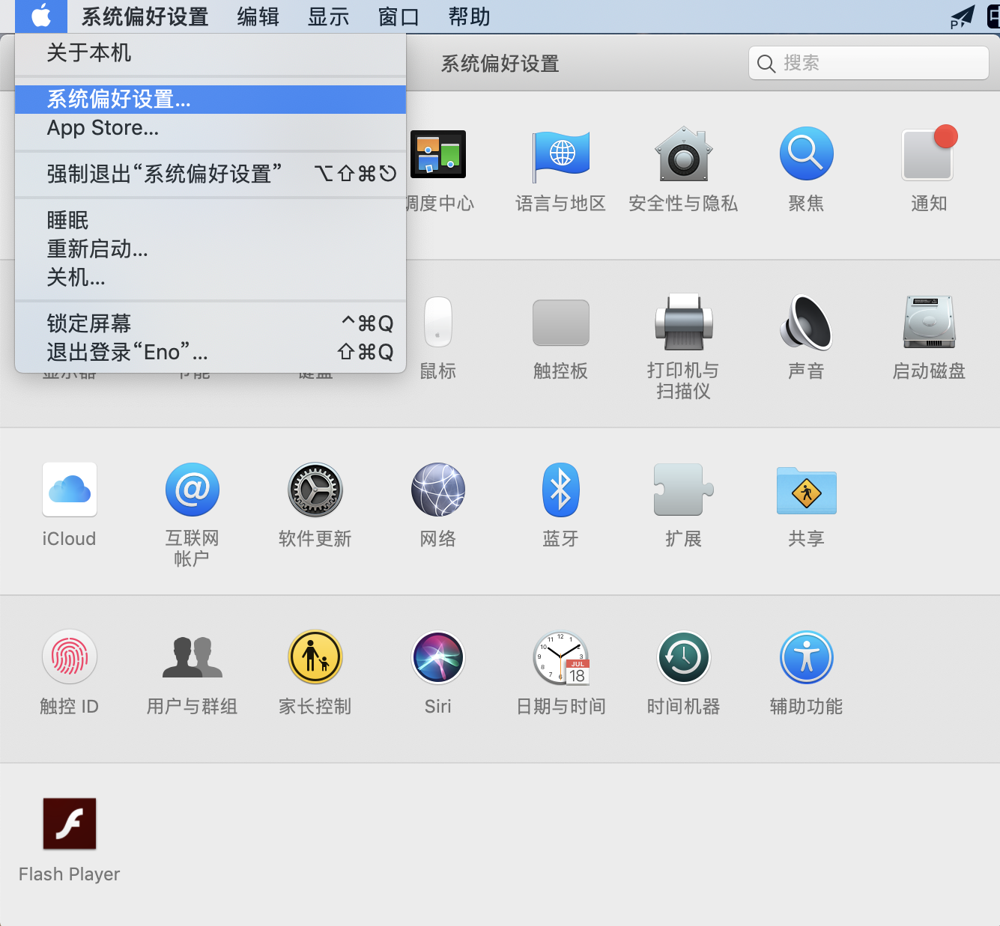
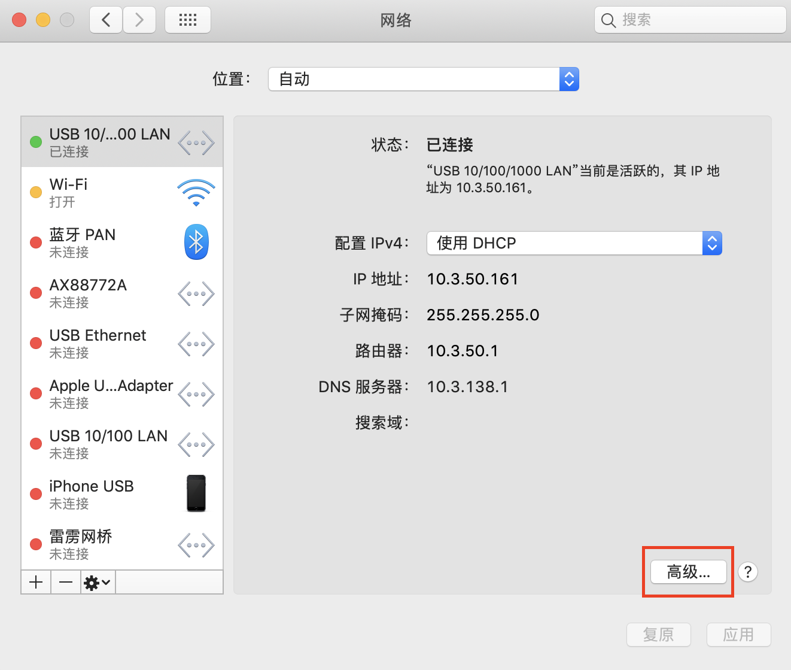
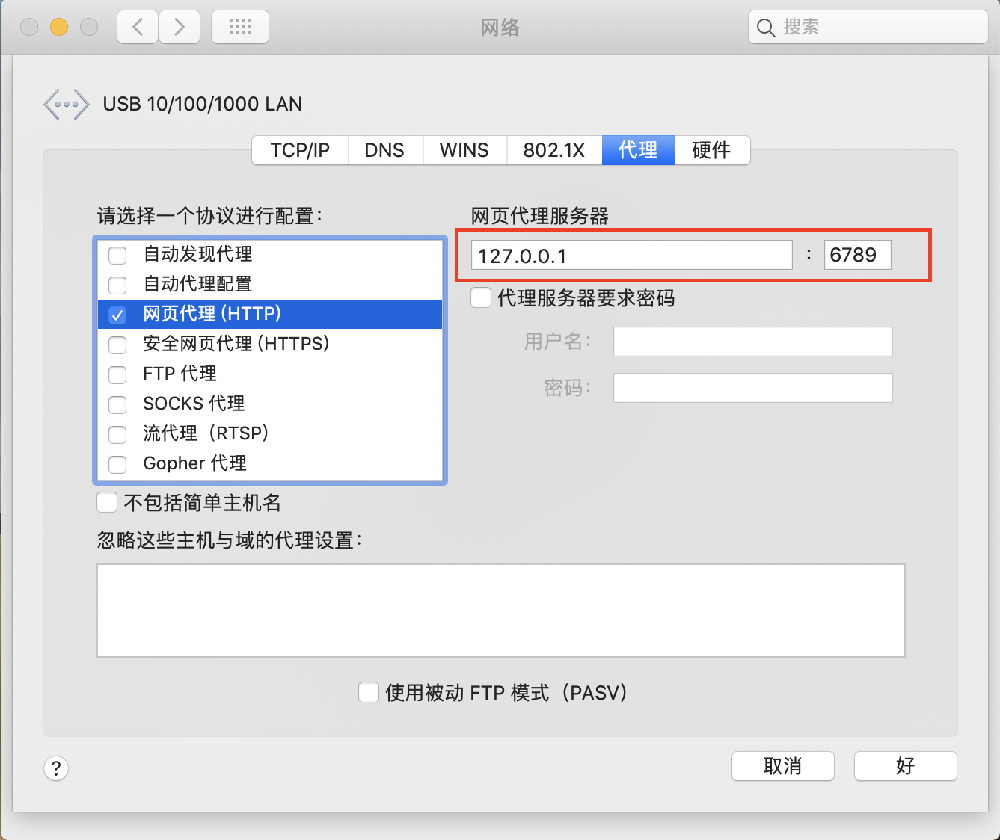

# MITM

> 中间人攻击（Man-in-the-MiddleAttack，简称“MITM攻击”）是一种“间接”的入侵攻击，这种攻击模式是通过各种技术手段将受入侵者控制的一台计算机虚拟放置在网络连接中的两台通信计算机之间，这台计算机就称为'中间人'，——解释来自于[百度百科](https://baike.baidu.com/item/%E4%B8%AD%E9%97%B4%E4%BA%BA%E6%94%BB%E5%87%BB/17397300)


我们常用的[Fiddler](https://www.telerik.com/fiddler)和[Charles](https://www.charlesproxy.com/)，就是基于该原理实现的。

我们可以基于`MITM`做以下内容

- 请求劫持
- 伪造请求
- 过滤数据
- 调试接口

# 思路分析



所以我们终极目标就是伪造一个代理服务器，用于建立一个可以同时与客户端和服务端进行通信的网络服务(欺骗客户端和服务端存放的中间人)

这个中间人充当的就是一个卧底的角色，所有请求和响应都经过他手，而服务器和客户端都不能感知到他的威胁

# HTTP代理实现

`HTTP`是明文传输的，所以在这里实现中间人代理就会非常简单
```js
const http = require('http');
const url = require('url');
let httpMitmProxy = new http.Server();
// 启动端口
let port = 6789;
httpMitmProxy.listen(port, () => {
    console.log(`HTTP中间人代理启动成功，端口：${port}`);
});
// 代理接收客户端的转发请求
httpMitmProxy.on('request', (req, res) => {
    // 解析客户端请求
    var urlObject = url.parse(req.url);
    let options = {
        protocol: 'http:',
        hostname: req.headers.host.split(':')[0],
        method: req.method,
        port: req.headers.host.split(':')[1] || 80,
        path: urlObject.path,
        headers: req.headers
    };
    console.log(`请求方式：${options.method}，请求地址：${options.protocol}//${options.hostname}:${options.port}${options.path}`);
    // 根据客户端请求，向真正的目标服务器发起请求。
    let realReq = http.request(options, (realRes) => {
        // 设置客户端响应的http头部
        Object.keys(realRes.headers).forEach(function (key) {
            res.setHeader(key, realRes.headers[key]);
        });
        // 设置客户端响应状态码
        res.writeHead(realRes.statusCode);
        // 通过pipe的方式把真正的服务器响应内容转发给客户端
        realRes.pipe(res);
    });
    // 通过pipe的方式把客户端请求内容转发给目标服务器
    req.pipe(realReq);
    realReq.on('error', (e) => {
        console.error(e);
    })
})
```
具体源代码请看[这里](https://github.com/Wscats/node-tutorial/blob/master/middlewareAgent/browserAgent/http/http.js)

# HTTPS代理实现

## HTTP VS HTTPS
回想上一节的http代理，我们是基于应用层的http协议实现的代理功能。由于http是明文传输，代理可以解析出客户端的真实的请求报文，并且拿着该请求报文"代表"客户端向真正的服务器发起请求。那么https是否仍然可以通过这样的方式进行代理？

先简单说下`SSL/TLS，SSL/TLS`协议是为了解决这三大风险而设计的

- 所有信息都是加密传播，第三方无法窃听。
- 具有校验机制，一旦被篡改，通信双方会立刻发现。
- 配备身份证书，防止身份被冒充。

## HTTP Tunnel(隧道)

基于`SSL/TLS`设计的第一点，可知代理是无法像解析单纯的http协议那样解析https的报文，从而也无法像代理http那样代理https。在实际网络中，每个网络请求都会经过各种个样的网络节点，代理也是其中很常见的一种。

https请求如何通过这些http代理节点连接到目标服务器？为了解决这类问题，`http tunnel(隧道)`技术就派上了用场。

||HTTP||HTTPS||
|-|-|-|-|-|
||||http|应用层|
|应用层|HTTP||TCL/SSL|安全层|
||TCP|--传输层-->|TCP|传输层|
||IP|--网络层-->|IP|网络层
||网络接口|--数据链路层-->|网络接口|数据链路层|
|||||物理层|

`HTTPS`的分层是在传输层之上建立了安全层，所有的`HTTP`请求都在安全层上传输。既然无法通过像代理一般`HTTP`请求的方式在应用层代理`HTTPS`请求，那么我们就退而求其次为在传输层为客户端和服务器建立起`TCP`连接。这种方式就像为客户端和服务器之间打通了一条`TCP`连接的隧道，作为`HTTP`代理对隧道里传输的内容一概不予理会，只负责传输。

## HTTP Tunnel的建立步骤

- 第一步：客户端像http代理发起CONNECT请求。
```js
CONNECT abc.com:443 HTTP/1.1
```
- 第二步：http代理接收到CONNECT请求后与abc.com的433端口建立tcp连接。

- 第三步：与abc.com的433端口建立tcp连接成功，通知客户端。
```js
HTTP/1.1 200 Connection Established
```

```js
const http = require('http');
const url = require('url');
const net = require('net');

let httpTunnel = new http.Server();
// 启动端口
let port = 6789;

httpTunnel.listen(port, () => {
    console.log(`HTTP中间人代理启动成功，端口：${port}`);
});

httpTunnel.on('error', (e) => {
    if (e.code == 'EADDRINUSE') {
        console.error('HTTP中间人代理启动失败！！');
        console.error(`端口：${port}，已被占用。`);
    } else {
        console.error(e);
    }
});
// http服务器必须在connect里面才能监听到https请求
// https的请求通过http隧道方式转发
// 这里就是上面第一步：客户端像http代理发起CONNECT请求
httpTunnel.on('connect', (req, cltSocket, head) => {
  // connect to an origin server
  var srvUrl = url.parse(`http://${req.url}`);

  console.log(`CONNECT ${srvUrl.hostname}:${srvUrl.port}`);
  
  var srvSocket = net.connect(srvUrl.port, srvUrl.hostname, () => {
    cltSocket.write('HTTP/1.1 200 Connection Established\r\n' +
                    'Proxy-agent: MITM-proxy\r\n' +
                    '\r\n');
    srvSocket.write(head);
    srvSocket.pipe(cltSocket);
    cltSocket.pipe(srvSocket);
  });
  srvSocket.on('error', (e) => {
      console.error(e);
  });
});
```
具体源代码请看[这里](https://github.com/Wscats/node-tutorial/blob/master/middlewareAgent/browserAgent/https/https.js)


不获取明文的代理，这种方式就是利用`http`得到请求信息然后借助`net`模块模拟客户端的`TCP`请求，这个实现方式跟Node官方文档的[connect事件例子](http://nodejs.cn/api/http.html#http_event_connect)非常相似
```js
const url = require('url');
const http = require('http');
const net = require('net');
const {
    port
} = config = {
    port: 6789
};
const server = http.createServer((req, res) => {
    // 代理HTTP
    const ip = res.socket.remoteAddress;
    const port = res.socket.remotePort;
    res.end(`您的 IP 地址是 ${ip}，您的源端口是 ${port}`);
});

// HTTP 隧道 代理HTTPS 流量 但由于加密 不能处理
server.on('connect', (req, socket) => {
    console.log('connect', req.url);
    const parsedUrl = url.parse('http://' + req.url);
    const {
        port,
        hostname
    } = parsedUrl;
    const clientSocket = net.connect(port, hostname, () => {
        socket.write('HTTP/1.1 200 Connection Established\r\n\r\n');
        // 异常必须监听，不然会出现错误
        socket.on('error', (e) => {
            console.log('socket', e);
            socket.end();
        })
        clientSocket.pipe(socket);
    }).on('error', e => {
        console.log('net', e);
        socket.end();
    });
    socket.pipe(clientSocket);

});
// 开启server 监听指定端口
server.listen(port, () => {
    console.log('server start');
});
server.on('error', (e) => {
    if (e.code == 'EADDRINUSE') {
        console.error('HTTP中间人代理启动失败！！');
        console.error(`端口：${port}，已被占用。`);
    } else if (e.code == 'ECONNRESET') {
        console.error(e);
    } else {
        console.error(e);
    }
});
```
具体源代码请看[这里](https://github.com/Wscats/node-tutorial/blob/master/middlewareAgent/browserAgent/https/https4.js)

# 生成CA证书

## 根证书

具体代码请看：[生成根证书](https://github.com/Wscats/node-tutorial/blob/master/middlewareAgent/CA/createRootCA.js)

执行完`npm run createRootCA`后，CA根证书的公私钥会生成到项目根路径的rootCA文件夹下

|||
|-|-|
|公钥文件|rootCA/rootCA.crt|
|私钥文件|rootCA/rootCA.key.pem|

## 安装CA根证书

⚠️注意：

- 1.必须要按照上面步骤先生成CA证书相关文件
- 2.每一次生成的证书和密钥都是独一无二的。

在MAC系统下找到**钥匙串访问**，然后双击打开证书文件`rootCA/rootCA.crt`完成安装，并且有可能需要在**信任-使用此证书时**里面设置**始终信任**。



或者在项目根路径下执行下面命令，然后输入用户密码或者指纹后即可安装成功。

```bash
sudo security add-trusted-cert -d -r trustRoot -k /Library/Keychains/System.keychain rootCA/rootCA.crt
```

## 子证书

执行完`npm run createCertByRootCA`后，CA子证书的公私钥会生成到项目根路径的cert文件夹下

|||
|-|-|
|公钥文件|cert/my.crt|
|私钥文件|cert/my.key.pem|

另外和CA根证书最大的不同是，该子证书是用CA根证书的私钥签名，而CA根证书是用自己的私钥自签名。这也从代码的角度认识到了证书链的原理
```js
// 用CA根证书私钥签名
cert.sign(caKey, forge.md.sha256.create());
```
配合HTTP隧道和证书实现HTTPS代理，具体源代码请看[https.js](https://github.com/Wscats/node-tutorial/blob/master/middlewareAgent/browserAgent/https/https.js)和[createFakeHttpsWebSite.js](https://github.com/Wscats/node-tutorial/blob/master/middlewareAgent/browserAgent/https/createFakeHttpsWebSite.js)

# 设置代理

## MAC

## 第一步

在**系统偏好设置**中打开**网络**



点击已经连接的网络中的**高级**选项


选择**代理**，只勾选`网页代理(HTTP)`，设置右边的**网页代理服务器**和**安全网页代理设置**，可以把它设置为`127.0.0.1:6789`


# 基于MITM原理实现的第三方模块

- [anyproxy](https://github.com/alibaba/anyproxy)
- [node-mitmproxy](https://github.com/wuchangming/node-mitmproxy)

# 参考文档

- [基于Node.js的HTTPS MITM(中间人)代理的原理和实现](https://github.com/wuchangming/https-mitm-proxy-handbook)