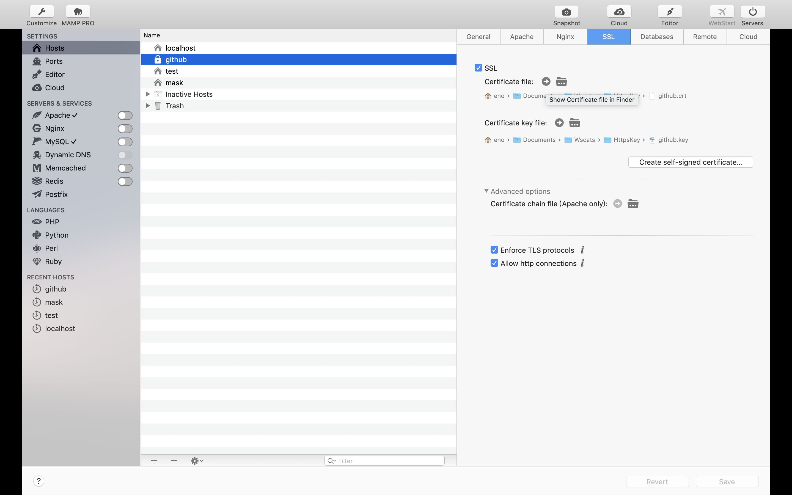

# Node启动https服务器

首先你需要生成https证书，可以去付费的网站购买或者找一些免费的网站，可能会是key或者crt或者pem结尾的。不同格式之间可以通过OpenSSL转换，我的证书是从`MAMP PRO`里面导出来的



Node原生版本:
```js
const https = require('https')
const path = require('path')
const fs = require('fs')
// 根据项目的路径导入生成的证书文件
const privateKey = fs.readFileSync(path.join(__dirname, './certificate/private.key'), 'utf8')
const certificate = fs.readFileSync(path.join(__dirname, './certificate/certificate.crt'), 'utf8')
const credentials = {
  key: privateKey,
  cert: certificate,
}
// 创建https服务器实例
const httpsServer = https.createServer(credentials, async (req, res) => {
  res.writeHead(200)
  res.end('Hello World!')
})
// 设置https的访问端口号
const SSLPORT = 443
// 启动服务器，监听对应的端口
httpsServer.listen(SSLPORT, () => {
  console.log(`HTTPS Server is running on: https://localhost:${SSLPORT}`)
})
```
# express版本

```js
const express = require('express')
const path = require('path')
const fs = require('fs')
const https = require('https')
// 根据项目的路径导入生成的证书文件
const privateKey = fs.readFileSync(path.join(__dirname, './certificate/private.key'), 'utf8')
const certificate = fs.readFileSync(path.join(__dirname, './certificate/certificate.crt'), 'utf8')
const credentials = {
  key: privateKey,
  cert: certificate,
}
// 创建express实例
const app = express()
// 处理请求
app.get('/', async (req, res) => {
  res.status(200).send('Hello World!')
})
// 创建https服务器实例
const httpsServer = https.createServer(credentials, app)
// 设置https的访问端口号
const SSLPORT = 443
// 启动服务器，监听对应的端口
httpsServer.listen(SSLPORT, () => {
  console.log(`HTTPS Server is running on: https://localhost:${SSLPORT}`)
})
```

# koa版本

```js
const koa = require('koa')
const path = require('path')
const fs = require('fs')
const https = require('https')
// 根据项目的路径导入生成的证书文件
const privateKey = fs.readFileSync(path.join(__dirname, './certificate/private.key'), 'utf8')
const certificate = fs.readFileSync(path.join(__dirname, './certificate/certificate.crt'), 'utf8')
const credentials = {
  key: privateKey,
  cert: certificate,
}
// 创建koa实例
const app = koa()
// 处理请求
app.use(async ctx => {
  ctx.body = 'Hello World!'
})
// 创建https服务器实例
const httpsServer = https.createServer(credentials, app.callback())
// 设置https的访问端口号
const SSLPORT = 443
// 启动服务器，监听对应的端口
httpsServer.listen(SSLPORT, () => {
  console.log(`HTTPS Server is running on: https://localhost:${SSLPORT}`)
})
```