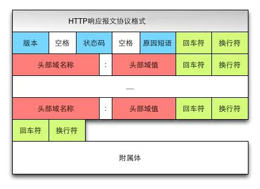

# 网络模型


# net、dgram、http、https

Node内置的模块，对应的网络通信方式

|模块|服务|
|-|-|
|net|TCP|
|dgram|UDP|
|http|HTTP|
|https|HTTPS|

## 传输层

- TCP 协议面向有连接，能正确处理丢包，传输顺序错乱的问题，但是为了建立与断开连接，需要至少7次的发包收包，资源浪费
- UDP 面向无连接，不管对方有没有收到，如果要得到通知，需要通过应用层

## 网络层

- 使用 IP 协议，IP 协议基于 IP 转发分包数据
- IP 协议是个不可靠协议，不会重发
- IP 协议发送失败会使用ICMP 协议通知失败
- ARP 解析 IP 中的 MAC 地址，MAC 地址由网卡出厂提供
- IP 还隐含链路层的功能，不管双方底层的链路层是啥，都能通信

## 链路层

驱动

## 物理层

将二进制的0和1和电压高低，光的闪灭和电波的强弱信号进行转换

输入url到页面加载都发生了什么事情？

# 输入url到页面加载都发生了什么事情？

## 3次握手

- 客户端–发送带有SYN标志的数据包–一次握手–服务端
- 服务端–发送带有SYN/ACK标志的数据包–二次握手–客户端
- 客户端–发送带有带有ACK标志的数据包–三次握手–服务端

## 4次挥手

- 客户端-发送一个FIN，用来关闭客户端到服务器的数据传送
- 服务器-收到这个FIN，它发回一个ACK，确认序号为收到的序号加1 。和SYN一样，一个FIN将占用一个序号
- 服务器-关闭与客户端的连接，发送一个FIN给客户端
- 客户端-发回ACK报文确认，并将确认序号设置为收到序号加1


```js
输入地址
浏览器查找域名的 IP 地址
这一步包括 DNS 具体的查找过程，包括：浏览器缓存->系统缓存->路由器缓存...
浏览器向 web 服务器发送一个 HTTP 请求
服务器的永久重定向响应（从 http://example.com 到 http://www.example.com）
浏览器跟踪重定向地址
服务器处理请求
服务器返回一个 HTTP 响应
浏览器显示 HTML
浏览器发送请求获取嵌入在 HTML 中的资源（如图片、音频、视频、CSS、JS等等）
浏览器发送异步请求
```

# 状态码

|1XX|2XX|3XX|4XX|5XX|
|-|-|-|-|-|
|信息性状态码|成功状态码|重定向|客户端错误状态码|服务端错误状态码|
|少见|200 OK|301 永久性重定向|400 请求报文语法错误|500服务器请求错误|
||204 响应报文不含实体的主体部分|302 临时性重定向(负载均衡)|401发送的请求需要有通过 HTTP 认证的认证信息 307 和302含义相同|503 服务器暂时处于超负载或正在停机维护，无法处理请求|
||206 范围请求|303 资源存在着另一个 URL，应使用 GET 方法定向获取资源|403 对请求资源的访问被服务器拒绝||
|||304 客户端已经执行了GET，但文件未变化。|404 服务器上没有找到请求的资源||


# http/https

`http`是应用层协议，建立在`TCP/IP`之上，`https`则建立在`TLS、SSL`加密层协议之上，现代web基本都是`http/https`应用。`TCP`在建立连接要发送报文，`http`也是，`http`报文分为请求报文和响应报文，报文格式如下：



对应的代码如下，注意换行和空格
```js
HTTP/1.0 200 OK    //起始行

Content-type:text/plain    //头部
Content-length:19            //头部  

Hi I'm a message!    //主体
```

Node中`http`模块提供创建基于http协议的网络通信应用的接口，**继承于net模块**，采用事件驱动机制，能与多个客户端保持连接，并不为每个连接开启新的进程或线程，低内存、高并发，性能优良。

# API


## 创建TCP、UDP客户端和服务端

在Node中，net模块提供创建基于TCP协议的网络通信的API。

首先引入内置`net`模块
```js
var net = require("net")
```
|方法|作用|
|-|-|
|`net.createServer([options][, connectionListener])`|创建一个 TCP 服务器。 参数 connectionListener 自动给 'connection' 事件创建监听器。|
|`net.connect(options[, connectionListener])`|返回一个新的 'net.Socket'，并连接到指定的地址和端口。 当 socket 建立的时候，将会触发 'connect' 事件。|
|`net.createConnection(options[, connectionListener])`|创建一个到端口 port 和 主机 host的 TCP 连接。 host 默认为 'localhost'。|
|`net.connect(port[, host][, connectListener])`|创建一个端口为 port 和主机为 host的 TCP 连接 。host 默认为 'localhost'。 参数 connectListener 将会作为监听器添加到 'connect' 事件。返回 'net.Socket'。|
|`net.createConnection(port[, host][, connectListener])`|创建一个端口为 port 和主机为 host的 TCP 连接 。host 默认为 'localhost'。 参数 connectListener 将会作为监听器添加到 'connect' 事件。返回 'net.Socket'。|
|`net.connect(path[, connectListener])`|创建连接到 path 的 unix socket 。参数 connectListener 将会作为监听器添加到 'connect' 事件上。返回 'net.Socket'。|
|`net.createConnection(path[, connectListener])`|创建连接到 path 的 unix socket 。参数 connectListener 将会作为监听器添加到 'connect' 事件。返回 'net.Socket'。|
|`net.isIP(input)`|检测输入的是否为 IP 地址。 IPV4 返回 4， IPV6 返回 6，其他情况返回 0。|
|`net.isIPv4(input)`|如果输入的地址为 IPV4， 返回 true，否则返回 false。|
|`net.isIPv6(input)`|如果输入的地址为 IPV6， 返回 true，否则返回 false。|

- `net.Socket`类提供了 TCP 或 UNIX Socket 的抽象，
- `net.createServer`用于创建服务端，
- `net.Socket`和`net.connect`用于创建客户端

## net.Server

`net.Server`通常用于创建一个`TCP`或本地服务器。

|方法|作用|
|-|-|
|`server.listen(port[, host][, backlog][, callback])`|监听指定端口 port 和 主机 host ac连接。 默认情况下 host 接受任何 IPv4 地址(INADDR_ANY)的直接连接。端口 port 为 0 时，则会分配一个随机端口。|
|`server.listen(path[, callback])`|通过指定 path 的连接，启动一个本地 socket 服务器。|
|`server.listen(handle[, callback])`|通过指定句柄连接。|
|`server.listen(options[, callback])`|options 的属性：端口 port, 主机 host, 和 backlog, 以及可选参数 callback 函数, 他们在一起调用server.listen(port, [host], [backlog], [callback])。还有，参数 path 可以用来指定 UNIX socket。|
|`server.close([callback])`|服务器停止接收新的连接，保持现有连接。这是异步函数，当所有连接结束的时候服务器会关闭，并会触发 'close' 事件。|
|`server.address()`|操作系统返回绑定的地址，协议族名和服务器端口。|
|`server.unref()`|如果这是事件系统中唯一一个活动的服务器，调用 unref 将允许程序退出。|
|`server.ref()`|与 unref 相反，如果这是唯一的服务器，在之前被 unref 了的服务器上调用 ref 将不会让程序退出（默认行为）。如果服务器已经被 ref，则再次调用 ref 并不会产生影响。|
|`server.getConnections(callback)`|异步获取服务器当前活跃连接的数量。当 socket 发送给子进程后才有效；回调函数有 2 个参数 err 和 count。|

```js
let server = net.createServer((socket) => {});
server.listen(3000, () => {});
```


## net.Socket事件

`net.Socket`对象是 TCP 或 UNIX Socket 的抽象。net.Socket 实例实现了一个双工流接口。 他们可以在用户创建客户端(使用 connect())时使用, 或者由 Node 创建它们，并通过 connection 服务器事件传递给用户。

- listening 当服务器调用 server.listen 绑定后会触发。
- connection 当新连接创建后会被触发。socket 是 net.Socket实例。
- close 服务器关闭时会触发。注意，如果存在连接，这个事件不会被触发直到所有的连接关闭。

|方法|作用|
|-|-|
|`lookup`|在解析域名后，但在连接前，触发这个事件。对 UNIX sokcet 不适用。|
|`connect`|成功建立 socket 连接时触发。|
|`data`|当接收到数据时触发。|
|`end`|当 socket 另一端发送 FIN 包时，触发该事件。|
|`timeout`|当 socket 空闲超时时触发，仅是表明 socket 已经空闲。用户必须手动关闭连接。|
|`drain`|当写缓存为空得时候触发。可用来控制上传。|
|`error`|错误发生时触发。|
|`close`|当 socket 完全关闭时触发。参数 had_error 是布尔值，它表示是否因为传输错误导致 socket 关闭。|

```js
let server = net.createServer((socket) => {
    socket.on('data', (data) => {});
    socket.on('end', () => {});
    socket.on('error', (err) => {});
    socket.on('close', () => {});
});
server.on('close', (socket) => {});
server.on('error', (e) => {});
```

# net.Sockets属性

`net.Socket`提供了很多有用的属性，便于控制`socket`交互：

|||
|-|-|
|`socket.connect(path[, connectListener])`|打开指定路径的 unix socket。通常情况不需要使用 net.createConnection 打开 socket。只有你实现了自己的 socket 时才会用到。|
|`socket.setEncoding([encoding])`|设置编码|
|`socket.write(data[, encoding][, callback])`|在 socket 上发送数据。第二个参数指定了字符串的编码，默认是 UTF8 编码。|
|`socket.end([data][, encoding])`|半关闭 socket。例如，它发送一个 FIN 包。可能服务器仍在发送数据。|
|`socket.destroy()`|确保没有 I/O 活动在这个套接字上。只有在错误发生情况下才需要。（处理错误等等）。|
|`socket.pause()`|暂停读取数据。就是说，不会再触发 data 事件。对于控制上传非常有用。|
|`socket.resume()`|调用 pause() 后想恢复读取数据。|
|`socket.setTimeout(timeout[, callback])`|socket 闲置时间超过 timeout 毫秒后 ，将 socket 设置为超时。|
|`socket.setNoDelay([noDelay])`|禁用纳格（Nagle）算法。默认情况下 TCP 连接使用纳格算法，在发送前他们会缓冲数据。将 noDelay 设置为 true 将会在调用 socket.write() 时立即发送数据。noDelay 默认值为 true。|
|`socket.setKeepAlive([enable][, initialDelay])`|禁用/启用长连接功能，并在发送第一个在闲置 socket 上的长连接 probe 之前，可选地设定初始延时。默认为 false。 设定 initialDelay （毫秒），来设定收到的最后一个数据包和第一个长连接probe之间的延时。将 initialDelay 设为0，将会保留默认（或者之前）的值。默认值为0。|
|`socket.address()`|操作系统返回绑定的地址，协议族名和服务器端口。返回的对象有 3 个属性，比如{ port: 12346, family: 'IPv4', address: '127.0.0.1' }。|
|`socket.unref()`|如果这是事件系统中唯一一个活动的服务器，调用 unref 将允许程序退出。如果服务器已被 unref，则再次调用 unref 并不会产生影响。|
|`socket.ref()`|与 unref 相反，如果这是唯一的服务器，在之前被 unref 了的服务器上调用 ref 将不会让程序退出（默认行为）。如果服务器已经被 ref，则再次调用 ref 并不会产生影响。|


`new net.Socket([options])`构造一个新的`socket`对象。
```js
let server = net.createServer((socket) => {
    socket.setEncoding('utf8');
    socket.write();
    socket.end();
});
```

# TCP模拟HTTP

可以用net模块模拟出http模块的功能

我们还可以在这里可以借助`socket.pipe`配合`fs.createWriteStream`来吧浏览器的数据保存到本地`message.txt`文件中，

在浏览器输入`http://localhost:3000`会返回hello
```js
let net = require('net');
let server = net.createServer({
    // 如果 pauseOnConnect 被设置为 true, 那么与连接相关的套接字都会暂停，也不会从套接字句柄读取数据。 这样就允许连接在进程之间传递，避免数据被最初的进程读取。 如果想从一个暂停的套接字开始读数据
    pauseOnConnect: true
}, (socket) => {
    socket.setEncoding('utf8');
    socket.on('data', (data) => {
        console.log(data);
    });
    socket.on('end', () => {
        console.log('client disconnected');
    });
    //接收到客户端发送的错误就会调用   
    socket.on('error', (err) => {
        console.log("error");
    });
    socket.on('close', () => {
        console.log("close socket");
    });
    socket.end(`
HTTP/1.1 200 OK
Content-Type: text/plain
Content-Length: 5

hello`)
    console.log('request');
});

server.listen(3000, () => {
    console.log('opened server on', server.address({}));
});
server.on('connection', (socket) => {
    console.log('connection');
});

//server.unref();//停止node对server的监听事件
//服务器关闭事件
server.on('close', (socket) => {
    console.log('close server');
});
server.on('error', (e) => {
    if (e.code === 'EADDRINUSE') {
        console.log('Address in use, retrying...');
        setTimeout(() => {
            server.close();
            server.listen(PORT, HOST);
        }, 1000);
    }
});
```
用`postman`测试，记录在`message.txt`的格式为
```js
POST /abc HTTP/1.1
Content-Type: multipart/form-data; boundary=--------------------------879095998142409176007484
abc: 123
bbb: ccc
ddd: eee
token: eyJkYXRhIjp7ImlucHV0RW1haWwiOiJsZW1vbiIsImlucHV0UGFzc3dvcmQiOiIxMjMifSwiY3JlYXRlZCI6MTU0NzA0MTEyMCwiZXhwIjo2MH0=.jP/Nm3RMzy6MGnH5uHWuvTkFZp94Bm5tMfDhhdRxlaM=
cache-control: no-cache
Postman-Token: 97b4950a-1169-407b-8787-ab238d3954d4
User-Agent: PostmanRuntime/7.6.0
Accept: */*
Host: localhost:3000
cookie: csrfToken=58RWUaRa3ZuA2uIp7cxn34pC
accept-encoding: gzip, deflate
content-length: 157
Connection: keep-alive

----------------------------879095998142409176007484
Content-Disposition: form-data; name="x"

x
----------------------------879095998142409176007484--
```
从[net源码](https://github.com/nodejs/node/blob/master/lib/_http_server.js)中我们也可以看到这些设置，从中我们得知`http`模块是真的基于`net`模块实现的
```js
var statusLine = `HTTP/1.1 ${statusCode} ${this.statusMessage}${CRLF}`; // line 252

function Server(options, requestListener) {
  net.Server.call(this, { allowHalfOpen: true });
  if (requestListener) {
    this.on('request', requestListener);
  }
} // line 283

net.Server.call(this, { allowHalfOpen: true }); //line 298
```

# 参考文档

- [Node学习记录：网络编程](https://segmentfault.com/a/1190000009469920)
- [基于tcp的http应用，断点续传，范围请求](https://juejin.im/post/5b3b35ce5188251a9e16cb4c)
